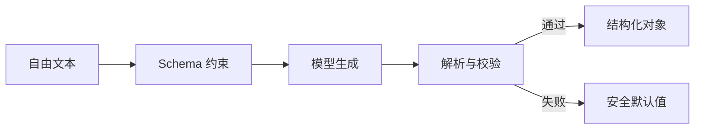

# 1. 结构化输出范式

## 学术源头

结构化输出范式的理论基础可追溯到约束生成与模式化解码研究。经典工作包括：

- Jason Eisner, "Structure and Interpretation of Constrained Decoding"（相关约束生成理论，早期形式化建模）。
- OpenAI 的 JSON Schema / Tool Calling 结构化接口设计。

其核心思想可理解为：给定一个模型输出分布 $p(y \mid x)$，在约束集合 $C$ 下生成满足约束的输出，即

$$
\hat{y} = \arg\max_{y \in C} p(y \mid x)
$$

其中 $C$ 可以是 JSON Schema、XML 结构或函数调用 schema。

## 工程痛点

在真实业务中，模型常常会把结构化内容混进自然语言叙述，导致下游系统直接报错。尤其在业务链路中，单纯依赖 `json.loads` 会在模型输出带有 Markdown 标注、尾随注释或 XML 未闭合时直接失效。

## 架构原理

## 工程量化折中

- Latency：轻微增加，主要在解析与验证阶段。
- Token Cost：近似稳定，通常低于多样本推理。
- Accuracy：对格式错误和字段缺失具有显著抑制效果。

## 落地避坑

- 对关键字段使用严格 Schema，例如 `enum`、`pattern`、`maxLength`。
- 对模型输出做正则清洗，并在解析失败时回退到安全默认对象。
- 不要把所有内容都塞进一段自然语言，应把“格式”和“内容”分离建模。

## 与支撑能力的关系

结构化输出并不只是“格式控制”，它还依赖上下文工程来减少噪声输入，依赖评测体系来验证 schema 稳定性，依赖安全网关来避免被注入式内容污染。换句话说，这一范式是所有后续工作流的入口契约。
