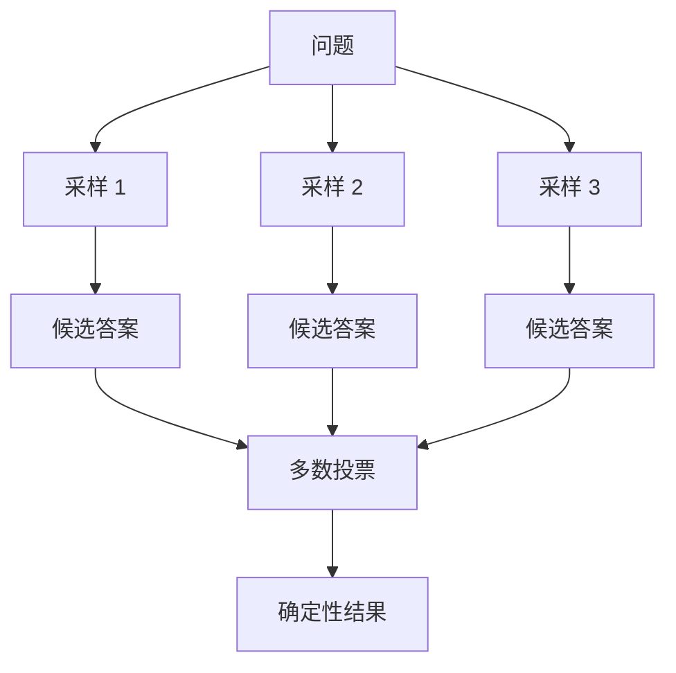

# 2. 推理与任务拆解范式

## 学术源头

- Wei et al., "Chain-of-Thought Prompting Elicits Reasoning in Large Language Models", NeurIPS 2022.
- Wang et al., "Self-Consistency Improves Chain of Thought Reasoning in Language Models", ICLR 2023.

Self-Consistency 的基本逻辑是：对同一个问题做 $n$ 次采样，得到若干候选答案 $a_1, \dots, a_n$，然后按多数投票选择最终答案。设每条采样链正确的概率为 $p$，则多数投票正确的概率近似为

$$
P(\text{consensus correct}) \approx \sum_{k>n/2} \binom{n}{k} p^k (1-p)^{n-k}
$$

当 $p > 0.5$ 且 $n$ 增大时，该概率通常会显著提升。

## 工程痛点

如果只进行一次推理，模型很容易在中间步骤出现局部错误，最终给出看起来合理但实际上错误的答案。尤其在数理推理、规则引擎和复杂计划任务里，这种“表面合理”问题非常常见。

## 架构原理

## 工程量化折中

- Latency：随着采样数增加线性上升。
- Token Cost：明显上升，通常比单链推理高出 $n$ 倍。
- Accuracy：对复杂问题的稳定性改善显著，但不应盲目加大 $n$。

## 落地避坑

- 对简单任务使用单轮推理即可，避免无谓多采样。
- 温度应维持在较低且可控水平，避免过度发散。
- 要把投票结果当成“置信度信号”，而不是绝对保证。

## 与支撑能力的关系

自一致性推理在生产中通常要和评测体系配合使用，否则你只能看到“更像样的答案”，却无法知道它是否真的更好；同时，长上下文压缩和路由会直接影响可供采样的证据质量。推理范式的稳定性，本质上来自输入质量和评测闭环。
