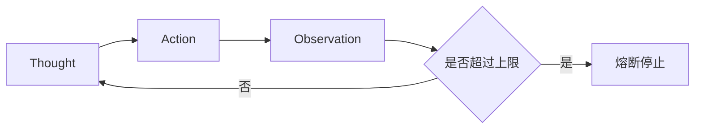

# 3. 工具与动作协同范式

## 学术源头

- Yao et al., "ReAct: Synergizing Reasoning and Acting in Language Models", ICLR 2023.

ReAct 形式化地把模型从被动生成器转变为具备状态转移能力的行动者。其核心状态转移可写为：

$$
S_{t+1} = T(S_t, H_t, A_t, O_t)
$$

其中 $S_t$ 表示当前状态，$H_t$ 为推理历史，$A_t$ 为执行动作，$O_t$ 为环境观察。通过这一循环，模型不仅“想”，也会“做”。

## 工程痛点

纯语言模型无法直接读取实时信息，也不适合直接执行外部操作。若没有工具接口，系统缺少事实 grounding；若没有熔断机制，多轮动作容易形成空转或死循环。

## 架构原理

## 工程量化折中

- Latency：受工具调用和网络往返影响，通常比纯生成更高。
- Token Cost：多轮思考与动作会显著增加成本。
- Accuracy：对需要实时信息的任务提升明显，但必须限制循环深度。

## 落地避坑

- 工具接口必须尽量简单、确定性强。
- 使用硬性 `max_iterations` 防止无效循环。
- 把工具返回的观察结果视为事实输入，而不是模型想象出来的“可能”。

## 与支撑能力的关系

ReAct 的工程难点不只是工具调用本身，而是状态如何保存、节点如何路由、异常如何可观测。实际落地时，控制流工程负责决定“下一步去哪”，可观测性负责记录“为什么这样走”，安全沙箱负责限制“能不能走”。
