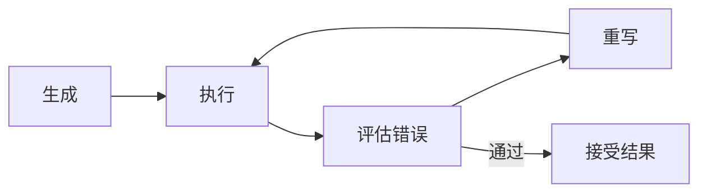

# 4. 反思与自愈范式

## 学术源头

- Madaan et al., "Self-Refine: Iterative Refinement with Self-Feedback", NeurIPS 2023.
- Shinn et al., "Reflexion: Language Agents with Verbal Reinforcement Learning", NeurIPS 2023.

该范式的关键假设是：模型不仅要生成一个答案，还要根据反馈对自身进行修正。若把经验库记为 $M_t$，评估函数记为 $E$，则修复过程可以视为

$$
x_{t+1} = G(x_t, E(x_t), M_t)
$$

其中 $x_t$ 是当前产物，$E(x_t)$ 是执行或评审反馈，$G$ 是生成器在反馈上的重写过程。

## 工程痛点

在代码生成、规则编排和自动化脚本场景中，第一次生成的结果往往存在语法错误、缺少边界条件或逻辑漏洞。如果没有反馈闭环，这些错误会在部署后才暴露，成本极高。

## 架构原理

## 工程量化折中

- Latency：明显增加，尤其在多轮修复时。
- Token Cost：通常高于单轮生成。
- Accuracy：对代码和复杂方案类任务收益明显，但需要限制迭代次数。

## 落地避坑

- 反馈信息要聚焦于具体错误，而不是泛化批评。
- 设置最大修复轮次，避免反复震荡。
- 保留最后一次成功版本，防止修复失败后覆盖掉可用结果。

## 与支撑能力的关系

反思闭环最怕的是“看不到错误”和“错误不可复现”。因此它天然依赖可观测性与评测体系：前者提供 Traceback、Span 和执行日志，后者提供是否真的修好的一致性判定；而状态机能力则负责把失败样本安全地挂起、恢复并继续执行。
