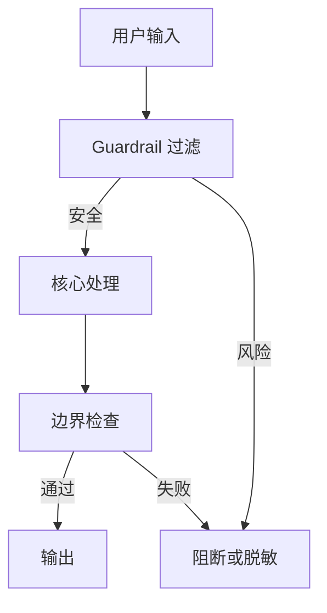

# 5. 防御与安全范式

## 学术源头

- Perez and Ribeiro, "Ignore Previous Prompt: Attack Techniques for Language Models"（prompt injection 相关研究）。
- NeMo Guardrails 相关工程化安全控制框架。

其核心思想是把“信任边界”显式纳入系统设计。若把系统提示词视为可信策略，用户输入视为不可信数据，则可以通过规则层、隔离层和边界检查来降低注入风险。

## 工程痛点

恶意用户可以通过诸如“忽略上述说明”之类的文本，诱导模型违背原有策略。对于客服系统、知识问答和内部工具接入，这类问题会导致规则失效、敏感数据暴露或拒答逻辑失控。

## 架构原理

## 工程量化折中

- Latency：通常增加少量前置过滤成本。
- Token Cost：较低，通常优于多轮反思式控制。
- Accuracy：能够显著降低被注入攻击和策略越权的风险。

## 落地避坑

- 明确区分系统规则与用户输入。
- 对敏感动作使用默认拒绝策略。
- 过滤规则不应仅依赖单一关键词，应结合多层防御。

## 与支撑能力的关系

安全范式不是孤立的过滤器，而是整套基础设施的一部分。缓存、网关、级联路由、审计日志和观测系统都会影响它的最终效果。一个真正可上线的防御系统，必须同时考虑规则、性能、可追溯性和灰度回滚。
