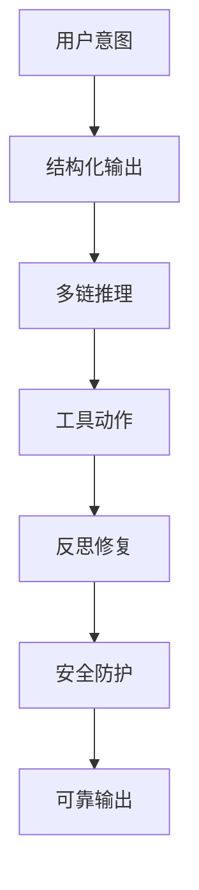

# Executable Prompt Engineering Paradigms

这是一套面向研发落地的提示词范式工程库，目标不是“把提示词写得更好看”，而是把大模型调用过程重构为一组可验证、可调试、可控的工程组件。它将提示词工程从经验主义，转向具有确定性边界的系统设计。

## 设计动机

在工业场景中，真正的成本不在于“模型能不能回答”，而在于回答是否稳定、是否可解析、是否安全、是否能在延迟和成本预算内完成。这里的核心问题是：如何让一个高自由度的生成模型，变成一个可被工程约束的有限状态机。

## 研究基础

本仓库中的五个范式分别对应于一组经典研究：

- Structuring: 结构化生成与约束输出，核心思想是把生成空间约束在 Schema/DTD/XML 之内。
- Reasoning: Chain-of-Thought 与 Self-Consistency，通过多条采样链进行多数投票降低随机性。
- Acting: ReAct，通过 Thought–Action–Observation 循环把推理和工具调用绑定。
- Reflection: Self-Refine / Reflexion，通过错误反馈形成自我修复闭环。
- Defense: Guardrails / Prompt Injection Defense，通过边界隔离与规则拦截增强安全性。

在此基础上，仓库还补入了四类支撑能力，但它们不是新的主线，而是嵌入前五大范式的工程底座：

- 数据与上下文工程：为结构化输出、推理输入和工具参数提供更干净的上下文。
- 控制流与状态机工程：为 ReAct、Reflection 及多阶段处理提供路由、终止和状态管理。
- 可观测性、评测与自动化：为五大范式提供测试、回归、Tracing 与质量门禁。
- 安全沙箱与基础设施：为所有用户输入与工具调用提供隔离、缓存和防御边界。

## 总体架构



## 完整目录

```text
Executable-Prompt-Paradigms/
├── 01-结构化输出范式/
├── 02-推理与任务拆解范式/
├── 03-工具与动作协同范式/
├── 04-反思与自愈范式/
└── 05-防御与安全范式/
```

## 量化折中

在工程落地中，提示词范式普遍需要在三维指标之间权衡：

- Latency：首字延迟与端到端时延。
- Token Cost：多样本采样、工具调用与反馈迭代带来的成本。
- Accuracy：结构化约束和多链推理所带来的结果稳定性提升。

通常而言，结构化输出和 Guardrails 主要提升准确性与安全性，但会增加少量前置解析成本；Self-Consistency 和 Reflection 会显著提升复杂任务的稳定性，但以更高的 Token 成本为代价；ReAct 则适用于需要外部信息的任务，但要通过熔断机制避免死循环。

## 快速开始

```bash
pip install -r requirements.txt
python 01-结构化输出范式/demo.py
python 02-推理与任务拆解范式/demo.py
python 03-工具与动作协同范式/demo.py
python 04-反思与自愈范式/demo.py
python 05-防御与安全范式/demo.py
```

## 目录说明

- 01-结构化输出范式：结构化输出与 Schema 约束，吸收上下文工程能力。
- 02-推理与任务拆解范式：多链推理与多数投票，吸收评测与采样稳定性能力。
- 03-工具与动作协同范式：工具调用与 ReAct 动作循环，吸收控制流与状态机能力。
- 04-反思与自愈范式：自我反思与错误修复，吸收评测、回归和状态保存能力。
- 05-防御与安全范式：注入防御与安全边界，吸收安全沙箱与基础设施能力。

## 阅读顺序建议

如果你是第一次看这套仓库，建议按下面顺序浏览：

1. 先看 01-结构化输出范式
2. 再看 02-推理与任务拆解范式
3. 然后按 03、04、05 的顺序理解工具、反思与安全
4. 最后结合各自 demo.py 进行实际运行
